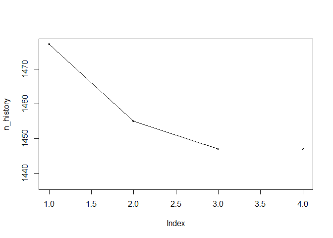

<!-- README.md is generated from README.Rmd. Please edit that file -->

# mstratal - Multivariate optimal stratification and allocation for stratified sampling scheme.

<!-- badges: start -->
<!-- badges: end -->

Package can be used for computation of multivariate optimal
stratification and allocation in stratified sampling. New numerical
method is implemented for determination of the strata boundaries given
the number of strata and target precision of estimation.

## Installation

You can install the development version of mstratal from
[GitHub](https://github.com/) with:

``` r
# install.packages("devtools")
devtools::install_github("rwieczor/mstratal")
```

## Example of solving bi-variate stratification and allocation problem

``` r
library(mstratal)

## Generation of correlated lognormal variables (x,y)
set.seed(3456)
ro <- 0.5 # correlation coefficient for lognormal variables
#
# correlation coefficient for normal variables (theoretical formula)
(ro_norm <- log(.5 * (exp(1) - 1) + 1))
#> [1] 0.6201145
```

``` r
#
x <- rnorm(10000)
z <- rnorm(10000)
y <- x * ro_norm + z * sqrt(1 - ro_norm^2)
x <- exp(x)
y <- exp(y)
cor(x, y)
#> [1] 0.523148
```

``` r
#
L <- 5
c <- 0.01

ex <- mstratal(cbind(x, y), L, c(c, c),
  opt_alg = "simplex",
  maxit1 = 20, maxit2 = 100, rel_tol = 0.01,
  verbose = TRUE,
  history = TRUE
)
#> Initial powers in cumulative rule =  0.5 0.5 
#> Initial sample size   =  1477 
#> Optimal powers in cumulative rule =  0.4676758 0.4619141 
#> Sample size for optimal cumulative power rule   =  1455 
#> 
#> CVs for stratification variables =  0.01 0.01 
#> Sample size from sequential simplex optimization =  1447 
#> 
#> CVs for stratification variables =  0.01 0.01 
#> Final sample size from sequential simplex optimization =  1447
```

``` r
ex
#> $bh
#>           bh1        bh2
#> 1   0.8797763  0.8867644
#> 2   1.9211935  1.9324344
#> 3   3.8266635  3.8966839
#> 4   7.9900455  7.9045024
#> 5 110.7148764 52.6409456
#> 
#> $nh
#> [1] 118 253 362 347 367
#> 
#> $n_history
#> [1] 1477 1455 1447 1447
```

``` r
sum(ex$nh) # total sample size
#> [1] 1447
```

``` r
# Plot for optimization history
n_history <- ex$n_history
plot(n_history,
  cex = 0.5,
  ylim = c(min(n_history) - 10, max(n_history))
)
lines(n_history)
abline(h = min(n_history), col = 3)
```


